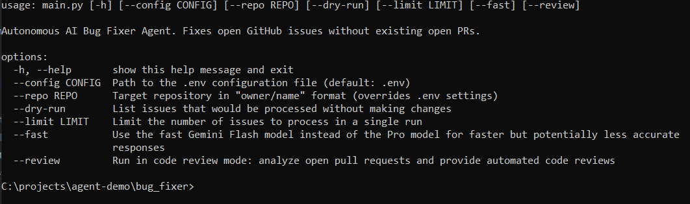

# 🤖 AI Bug Fixer Agent

An autonomous AI-powered agent that automatically fixes GitHub issues and provides code reviews using Google Gemini AI.

## Features

- 🔧 **Autonomous Bug Fixing**: Automatically analyzes and fixes open GitHub issues
- 🔍 **Code Review**: Provides comprehensive AI-powered code reviews for pull requests
- 🎯 **Targeted Fixes**: Makes minimal, precise changes instead of overwriting entire files
- 🚀 **Fast Mode**: Option to use Gemini Flash for faster responses
- 📊 **Smart Filtering**: Only processes issues without existing PRs and PRs without existing reviews
- 🔒 **Security-First**: Analyzes code for security vulnerabilities and best practices
- 📝 **Detailed Logging**: Comprehensive logging with emoji support and Windows compatibility

## Screenshot



## Installation

1. **Clone the repository**
   ```bash
   git clone <repository-url>
   cd bug_fixer
   ```

2. **Install dependencies**
   ```bash
   pip install -r requirements.txt
   ```

3. **Configure environment variables**
   Create a `.env` file in the root directory:
   ```env
   GITHUB_TOKEN=your_github_personal_access_token
   GEMINI_API_KEY=your_google_gemini_api_key
   REPO_OWNER=your_github_username
   REPO_NAME=your_repository_name
   
   # Optional: Separate token for code reviews
   GITHUB_CODEREVIEW_TOKEN=your_separate_review_token
   ```

## Usage

### Bug Fixing Mode (Default)

**Basic usage:**
```bash
python main.py
```

**With options:**
```bash
python main.py --limit 5 --fast
```

**Quick run (batch files):**
- Double-click `run_agent_fast.bat` for fast bug fixing
- Double-click `run_review_fast.bat` for fast code reviews

### Code Review Mode

```bash
python main.py --review --limit 3
```

### Command Line Options

| Option | Description |
|--------|-------------|
| `--config CONFIG` | Path to configuration file (default: `.env`) |
| `--repo REPO` | Target repository in "owner/name" format |
| `--dry-run` | List issues without making changes |
| `--limit LIMIT` | Maximum number of issues/PRs to process |
| `--fast` | Use Gemini Flash model for faster responses |
| `--review` | Run in code review mode for pull requests |

## How It Works

### Bug Fixing Process

1. **Issue Discovery**: Fetches open GitHub issues without existing pull requests
2. **Codebase Analysis**: Analyzes repository structure and relevant files
3. **AI Analysis**: Uses Google Gemini to understand the issue and create targeted fixes
4. **Smart Replacement**: Applies minimal, context-aware changes to files
5. **PR Creation**: Creates a pull request with the fix and detailed explanation

### Code Review Process

1. **PR Discovery**: Fetches open pull requests without existing reviews
2. **Change Analysis**: Analyzes file changes and modifications
3. **AI Review**: Comprehensive review covering:
   - Security vulnerabilities
   - Performance implications
   - Code quality and style
   - Logic correctness
   - Maintainability concerns
4. **Review Posting**: Posts structured review with recommendations

## Key Features

### 🎯 Targeted Fixes
- Makes minimal changes instead of rewriting entire files
- Smart context matching for ambiguous replacements
- Preserves existing code style and formatting

### 🔍 Smart Filtering
- **Issues**: Only processes issues without existing open PRs
- **Reviews**: Only reviews PRs without existing automated reviews
- **Limits**: Respects `--limit` flag early in the workflow

### 🚀 Performance Options
- **Pro Model**: `gemini-2.5-pro-preview-05-06` (default) - Higher accuracy
- **Fast Model**: `gemini-2.5-flash-preview-05-20` (with `--fast`) - Faster responses

### 🔒 Security & Quality
- Security vulnerability detection
- Performance impact analysis
- Code style and standards compliance
- Logic and correctness verification
- Maintainability assessment

### 📊 Comprehensive Logging
- Detailed operation logs in `bug_fixer.log`
- AI interaction logs in `ai_responses.log`
- Windows-compatible emoji handling (text equivalents in console)
- Color-coded console output

## File Structure

```
bug_fixer/
├── main.py                          # Entry point
├── requirements.txt                 # Dependencies
├── .env.example                     # Environment template
├── run_agent_fast.bat              # Quick bug fixing
├── run_review_fast.bat             # Quick code review
├── src/
│   ├── core/                       # Core services
│   │   ├── enhanced_agent.py       # Main agent controller
│   │   ├── enhanced_bug_fixer_service.py
│   │   ├── code_review_service.py
│   │   └── config.py
│   ├── clients/                    # External API clients
│   │   ├── enhanced_ai_client_v2.py
│   │   └── github_client.py
│   ├── models/                     # Data models
│   │   ├── bug_models.py
│   │   └── review_models.py
│   └── utils/                      # Utilities
│       ├── enhanced_git_operations.py
│       ├── codebase_analyzer.py
│       ├── ai_logger.py
│       └── git_operations.py
└── logs/                           # Generated logs
```

## Configuration

### Environment Variables

| Variable | Required | Description |
|----------|----------|-------------|
| `GITHUB_TOKEN` | Yes | GitHub personal access token with repo permissions |
| `GEMINI_API_KEY` | Yes | Google Gemini API key |
| `REPO_OWNER` | Yes | GitHub repository owner/organization |
| `REPO_NAME` | Yes | GitHub repository name |
| `GITHUB_CODEREVIEW_TOKEN` | No | Separate token for code reviews |

### GitHub Token Permissions

Your GitHub token needs the following permissions:
- `repo` - Full repository access
- `pull_requests:write` - Create and update pull requests
- `issues:read` - Read repository issues

## Examples

### Fix a Single Issue Quickly
```bash
python main.py --limit 1 --fast
```

### Review Pull Requests
```bash
python main.py --review --limit 3
```

### Dry Run (See What Would Be Processed)
```bash
python main.py --dry-run --limit 10
```

### Use Custom Repository
```bash
python main.py --repo "microsoft/vscode" --limit 1
```

## Troubleshooting

### Common Issues

**Authentication Errors**
- Verify GitHub token has correct permissions
- Check that token isn't expired
- Ensure repo owner/name are correct

**No Issues Found**
- Repository may have no open issues without PRs
- Check if issues exist and don't have associated pull requests

**Ambiguous Replacements**
- The agent now uses smart context matching
- If issues persist, check the AI logs for details

**Unicode/Emoji Issues (Windows)**
- The agent automatically handles Windows console compatibility
- Emojis appear as text equivalents in console but are preserved in logs

### Logs

- **`bug_fixer.log`** - Main application logs
- **`ai_responses.log`** - AI interaction logs and responses
- Console output shows real-time progress with emoji support

## Contributing

1. Fork the repository
2. Create a feature branch
3. Make your changes
4. Add tests if applicable
5. Submit a pull request

## License

This project is licensed under the MIT License - see the LICENSE file for details.

## Support

For issues and questions:
1. Check the logs in `bug_fixer.log` and `ai_responses.log`
2. Review the troubleshooting section
3. Create an issue in the repository with log details
